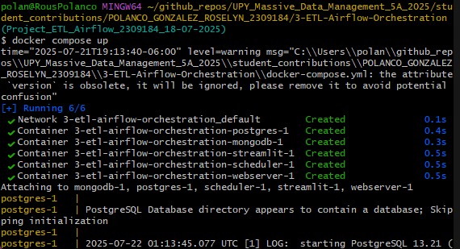
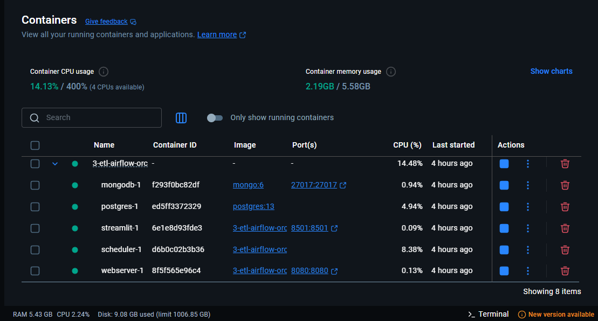
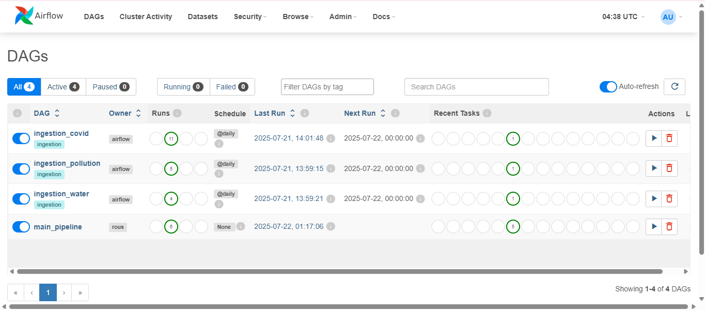
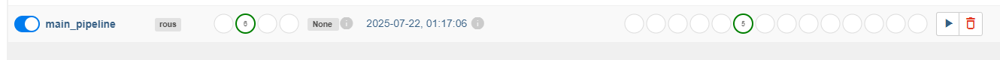
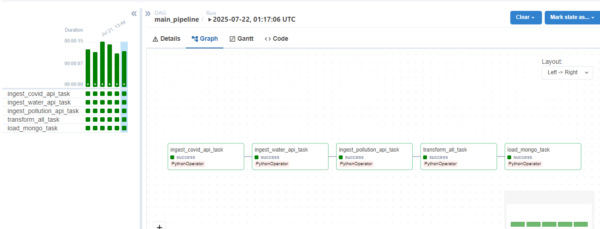
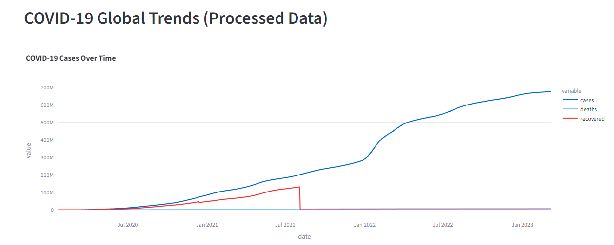
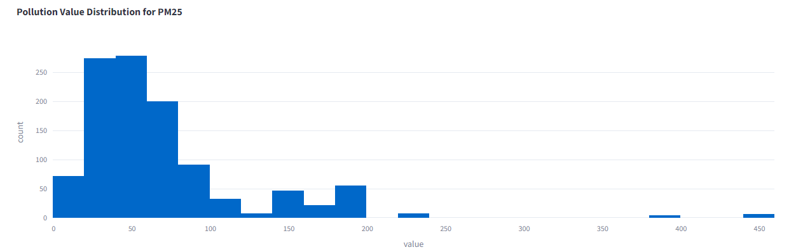
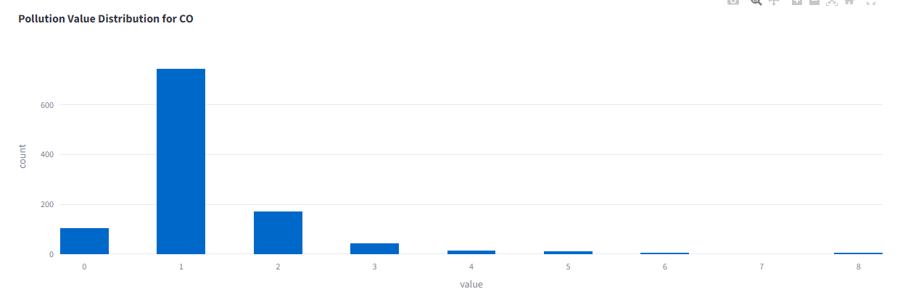
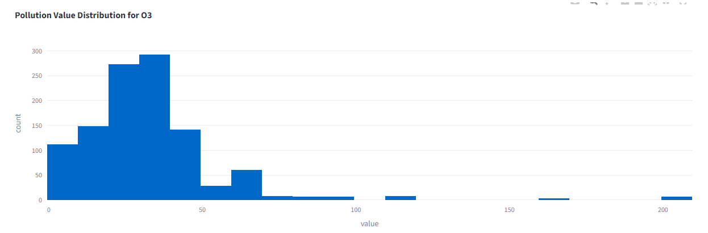
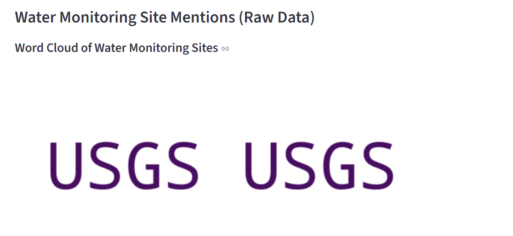

# 🌍 Environmental Data Dashboard – PROJECT Batch ETL with Docker

This project is part of the **Massive Data Management** course. It builds a full **ETL pipeline** using **Apache Airflow**, **MongoDB**, and **Streamlit** to collect, process, and visualize real-world environmental data from three different public APIs. The processed data is visualized via multiple dashboards in Streamlit, with each dashboard accessible through separate pages in the app UI.

---

## 📂 Project Structure

```bash
3-ETL-Airflow-Orchestration/                 # Main Project Folder
├── dags/                                    # Contains Airflow DAGs and utility scripts
│   ├── pycache/                  
│   └── utils/                               # ETL scripts and helpers
│   |    ├── mongo_utils.py                  # Functions to connect and write to MongoDB
│   |    └── transform_all_collections.py    # Transformation logic for all collections
│   ├── ingestion_covid.py                   # Ingests COVID-19 data from API
│   ├── ingestion_pollution.py               # Ingests pollution data from API
│   ├── ingestion_water.py                   # Ingests water monitoring data from API
│   ├── main_pipeline.py                     # Defines the main ETL pipeline
│   └── transform_all.py                     # Main transformation script
├── logs/                                    # Stores Airflow logs
├── streamlit_app/                           # Dashboard folder
|   ├── app.py                               # Streamlit app for data visualization 
│   └── Dockerfile                           # Docker image configuration
├── docker-compose.yml                 
├── Dockerfile                               # Orchestration of all containers
├── README.md                                # Main Project documentation
└── requirements.txt                       # List of Python dependencies
```

--- 

## 📌 Project Overview

- **Extract** data from 3 different public APIs (COVID-19, Air Pollution, and Water Data).
- **Transform** the data to clean, enrich, and prepare it for analysis.
- **Load** the results into MongoDB (raw and processed collections).
- **Visualize** insights with a dashboard using Streamlit.

Note: All services run in containers using **Docker Compose**.

---

## 🌐 Public APIs Used

| API | Source | Link |
|-----|--------|------|
| COVID-19 | disease.sh | https://disease.sh/v3/covid-19/historical/all?lastdays=all |
| Air Pollution | OpenDataSoft | https://public.opendatasoft.com/api/records/1.0/search/?dataset=worldwide-pollution&rows=100&format=json |
| Water Data | USGS | https://api.waterdata.usgs.gov/ogcapi/v0/collections/daily/items?f=json&limit=100 |

---

## ⚙️ Technologies Used

- **Orchestration:** Apache Airflow
- **Database:** MongoDB, PostgreSQL
- **Data Visualization:** Streamlit
- **Containerization:** Docker, Docker Compose
- **Libraries in Python:** pandas, pymongo, requests, beautifulsoup4, lxml, wordcloud, matplotlib, Pillow, plotly, tabulate

---

## 💼 How to launch each service of Docker-Compose

Now it is necessary you follow the next steps to make it works tha atl project.

1. Clone the repository:

   First
   ```bash
   git clone https://github.com/your-username/3-ETL-Airflow-Orchestration.git
   cd 3-ETL-Airflow-Orchestration
   ```
   Second
   ```bash
   docker-compose run --rm webserver airflow db init
   ```

3. Docker initialization: 
Ensure you have Docker Desktop installed and running. If you are in MacOs/Linux you can use:
    ```bash
    docker-compose run --rm webserver airflow users create \
        --username airflow \
        --firstname Admin \
        --lastname User \
        --role Admin \
        --email admin@example.com \
        --password airflow
    ```

    If you are in Windows Powershell:

    ```bash
    docker-compose run --rm webserver airflow users create `
        --username airflow `
        --firstname Admin `
        --lastname User `
        --role Admin `
        --email admin@example.com `
        --password airflow
    ```

4. Build and start the services using git bash:
    ```bash
    docker-compose up --build
    ```
    
    

5. Access the interfaces:

    ```bash
    Airflow UI: http://localhost:8080
    ```

6. Access streamlit app:
    ```bash
    Streamlit App: http://localhost:8501
    ```

7. Mongo DB Compass connection:
    ```bash
    MongoDB: Port 27017 (backend service, no UI by default)
    ```

---

## ✅ How to Trigger the DAG and Check Logs

1. Open the Airflow UI: http://localhost:8080

    - Login: airflow / airflow (default credentials)


2. Locate the DAG named main_pipeline and toggle it ON.

3. Click the Play (Trigger DAG) button to run it manually.


4. To check task logs:
    - Click the DAG > Graph View or Tree View
    - Click a task box > Log


---

## 📊 How to Open the Streamlit Dashboard

After starting the services with Docker Compose, go to:

```bash
👉 http://localhost:8501
 ```

The dashboard includes:
- A bar chart for COVID-19 cases
- A line chart for pollution over time
- A word cloud of water site locations

This project and dashboard shows the different data between the three topics.
    
1️⃣ COVID-19 Dashboard
- **Theme:** COVID-19 cases over time.



2️⃣ Air Pollution Levels Dashboard
- **Theme 1:** Pollution value distribution for PM25


- **Theme 2:** Pollution value distribution for CO


- **Theme 3:** Pollution value distribution for NO2


- **Theme 4:** Pollution value distribution for O3



3️⃣ Water Monitoring Site Mentions Dashboard
- **Theme:** Wordcloud of water monitoring sites


---

## ✅ MongoDB vs PostgreSQL Clarification

It was chose **MongoDB** instead of PostgreSQL because:

- The data from the APIs is **semi-structured** (JSON format).
- MongoDB supports **flexible schema**, which is useful when the structure of API responses may change.
- It is easier to store and query nested JSON documents in MongoDB.

However, for structured data and complex SQL queries, PostgreSQL would be a better option.

---

## 📝 Explanation of XCom Usage

In this project, Airflow’s XCom (Cross-Communication) is used to pass data between tasks.

- For example, the ingestion task extracts the raw JSON data.
- It then pushes the data to XCom.
- The transformation task pulls it from XCom, processes it, and writes it to MongoDB.

This helps to keep tasks independent while still sharing temporary data.
But it was not used properly and in its totality.

---

## 🛡️ Containerization

📦 Docker Compose
The entire stack is containerized with Docker:

- **MongoDB:** Data Warehouse
- **PostgreSQL:** Airflow Backend
- **Airflow Webserver & Scheduler:** ETL Orchestration
- **Streamlit App:** Data Visualization

---

## ✅ Author

- Roselyn Polanco González
- 21/07/2025
